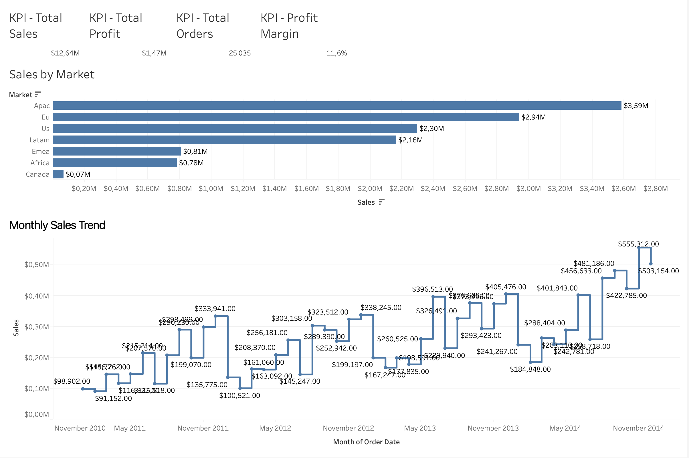

# Global-Sales-Profitability-Dashboard
An executive-style Tableau dashboard analyzing 25K+ retail orders and $12.6M in revenue to track profitability trends, market dynamics, and top-performing products.
# Retail Sales & Profitability Dashboard (Tableau)

## 📌 Business Overview
This project presents an executive-style retail analytics dashboard designed to track key sales metrics, identify profit drivers, and evaluate category/market performance across global operational data.

## 💡 Key Metrics & Insights
* **Total Volume:** Analyzed **25,035 orders** generating **$12.64M in total sales** and **$1.47M in profit**.
* **Profitability:** Maintained an overall **11.6% profit margin**, identifying high-margin product categories and underperforming markets.
* **Customer Demand:** Identified Top 10 revenue-generating products using advanced filtering and calculated fields.

##  Technical Implementation
* **Calculated Fields:** Custom measures built for `Profit Margin` and unique order counting (`COUNTD([Order ID])`).
* **Visual Scaffolding:** Designed high-impact KPI cards, monthly sales trendlines, geographic market heatmaps, and dynamic Top-N rankings.
* **Data Architecture:** Transformed raw transactional data into an interactive visual story to support data-driven business decisions.

##  Interactive Dashboard
👉 **[Click here to view and interact with the live dashboard on Tableau Public](https://public.tableau.com/views/Superstole/MonthlySalesTrend?:language=en-GB&:sid=&:redirect=auth&:display_count=n&:origin=viz_share_link)**

---
###  Repository Structure
* `data/` — Contains raw transactional CSV data.
* `retail_analysis.twbx` — Tableau Packaged Workbook file.
* `README.md` — Project summary and documentation.
